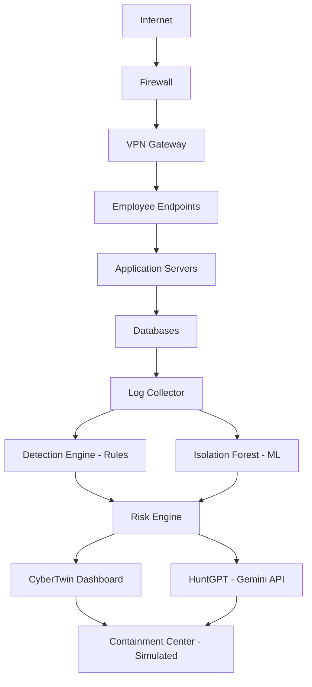
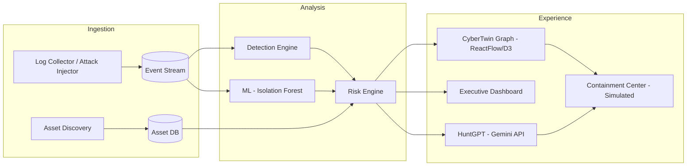

# Product Requirements Document (PRD)

## CyberTwin AI
**AI-Powered Cybersecurity Digital Twin & SOC Copilot**

| | |
|---|---|
| **Document Version** | 1.0 |
| **Status** | Draft for Review |
| **Prepared For** | Bharat Academix CodeQuest 2026 — Round 2 |
| **Audience** | Hackathon Judges, Investors, Engineering Team, Incubator Reviewers |
| **Reviewers (Roles Represented)** | Senior PM (CrowdStrike), Principal Security Architect (Splunk), Product Lead (Microsoft Sentinel), YC Founder, Staff ML Engineer, CISO, SOC Analyst |

---

## 1. Executive Summary

CyberTwin AI is an AI-powered cybersecurity digital twin and Security Operations Center (SOC) copilot built to give small and mid-sized organizations the visibility, detection, and investigation capabilities normally reserved for enterprises with full-time security teams. The platform mirrors an organization's digital assets as a live, interactive graph, layers rule-based and machine-learning detection on top of simulated telemetry, and lets a non-expert operator investigate and respond to incidents through a natural-language SOC copilot, HuntGPT. The MVP, scoped for CodeQuest 2026 Round 2, demonstrates the full detect-investigate-respond loop end to end using synthetic data, with all containment actions clearly simulated rather than wired into live infrastructure.

---

## 2. Problem Statement

Cyberattacks against Indian organizations have escalated sharply, with ransomware incidents, credential-stuffing campaigns, and data exfiltration attempts now routine rather than exceptional. Industry breach reports consistently show that the global average time to identify and contain a breach still runs into several months, and the financial toll of cybercrime is measured in trillions of dollars worldwide each year. Behind these numbers sits a structural problem: enterprise-grade security operations depend on expensive SIEM platforms, 24/7 SOC staffing, and specialized threat hunters — resources that are simply out of reach for the vast majority of small and medium enterprises.

This gap is acute in India. SMEs, hospitals, regional banks, and EdTech startups increasingly hold sensitive financial, medical, and personal data, yet most run with a single IT administrator wearing every hat, no dedicated analyst, and no real-time view of their own attack surface. A hospital's patient records system can be exfiltrated for weeks before anyone notices unusual database activity. A small bank's branch VPN can be brute-forced from an unfamiliar geography while logs sit unreviewed in a server nobody monitors. An EdTech platform handling student and parent data can suffer credential stuffing against its login portal with no alerting in place at all. These are not hypothetical scenarios — they reflect the everyday reality of breach awareness arriving only after damage is done, often through a customer complaint, a ransom note, or a regulator's inquiry rather than internal detection.

Even organizations that do invest in a SIEM frequently find themselves drowning rather than informed: high licensing costs, steep deployment complexity, and a torrent of low-fidelity alerts produce chronic alert fatigue, made worse by a well-documented global shortage of trained SOC talent able to triage that volume. What these organizations need is not another raw log aggregator, but proactive, explainable, continuously updated visibility into their cyber posture — paired with guidance an IT generalist, not just a security specialist, can act on.

---

## 3. Product Vision

CyberTwin AI aims to democratize enterprise-grade Security Operations Center capabilities for small and medium-sized organizations that cannot afford expensive SOC teams, SIEM deployments, MDR services, or dedicated threat hunters. It does this by combining a **Cybersecurity Digital Twin** — a living visual model of an organization's assets and their risk relationships — with an **AI-powered SOC Copilot** that provides security visibility, threat detection, attack visualization, incident investigation, and guided containment recommendations in plain language.

---

## 4. Product Goals

1. Provide affordable, enterprise-style SOC capabilities to organizations with no dedicated security team.
2. Reduce the time and expertise required to investigate a security incident.
3. Visualize organizational cyber posture as an interactive, continuously updated digital twin.
4. Enable AI-assisted, natural-language investigation of threats and incidents.
5. Improve real-time security visibility for resource-constrained Indian SMEs.
6. Reduce alert fatigue through risk-prioritized, correlated alerting rather than raw log noise.
7. Provide explainable threat analysis that a non-specialist IT administrator can act on.
8. Demonstrate a credible, demoable detect-investigate-respond loop within hackathon constraints.

---

## 5. Out of Scope (MVP)

To keep the MVP demoable, safe, and achievable within the hackathon timeline, the following are explicitly **not** implemented in v1.0:

- Real EDR (Endpoint Detection & Response) agent
- CrowdStrike sensor integration
- Active Directory / LDAP integration
- AWS or Azure cloud posture management (CSPM)
- Real firewall integration or live network enforcement
- SOAR orchestration with third-party ticketing/response systems
- Real endpoint isolation or quarantine
- Multi-tenant architecture (single-org MVP only)

All "attacks" are synthetically generated telemetry, and all "containment actions" are simulated UI-level actions with no effect on live infrastructure. This is a deliberate safety and scope boundary, not an oversight.

---

## 6. User Personas

### Persona 1 — SME IT Administrator
**"I'm the only IT person here, and security is just one of my ten jobs."**

| | |
|---|---|
| **Pain Points** | Limited security expertise; no SOC or analyst support; tight budget constraints; no time to learn complex SIEM tooling |
| **Goals** | Detect attacks as they happen; understand what an incident means in plain language without needing security certifications |

### Persona 2 — Security Analyst
**"I need to get from alert to root cause fast, with context, not just raw logs."**

| | |
|---|---|
| **Pain Points** | Alert fatigue from low-fidelity signals; manual correlation across log sources is slow |
| **Goals** | Investigate alerts quickly; understand attack paths and blast radius across the asset graph |

### Persona 3 — CISO / Leadership
**"I need to know our risk posture without reading raw logs myself."**

| | |
|---|---|
| **Pain Points** | No consolidated view of organizational risk; difficulty communicating posture to the board |
| **Needs** | Executive visibility; concise risk reports; trend-level view of security posture over time |

---

## 7. MVP Scope — CyberTwin AI v1.0

The MVP is organized into 10 modules, each independently demoable, forming a continuous pipeline from asset onboarding through detection, visualization, AI-assisted investigation, and simulated containment.

### Module 1 — Asset Discovery
**Status: Fully Implemented**

Establishes the organization's known asset inventory, which anchors every later risk calculation and graph visualization.

- CSV upload for bulk asset import
- JSON import as an alternate structured format
- Asset inventory view with search/filter
- Manual criticality assignment (Low / Medium / High / Critical) per asset
- Persistent asset database
- Automatic graph generation from imported assets and their declared relationships

*Not implemented:* AWS discovery, Azure discovery, CrowdStrike sensor-based discovery.

### Module 2 — Log Collection
**Status: Implemented**

Feeds the detection pipeline with realistic, synthetic telemetry that mimics real infrastructure logs.

- Synthetic telemetry generator
- FastAPI application logs
- Sample VPN connection logs
- Sample firewall logs
- Linux `auth.log`-style authentication log support
- WebSocket streaming of live log events into the dashboard

*Not implemented:* AWS CloudTrail ingestion, Azure Monitor log ingestion.

### Module 3 — Attack Injection Engine
**Status: Implemented**

A controlled simulator that generates labeled, attack-shaped telemetry so the detection and ML pipeline have something realistic to catch during demos and testing. This is a closed-loop testing utility — it only ever writes synthetic events into CyberTwin AI's own internal log stream, with no outbound network activity and no interaction with real systems.

Simulated attack scenarios (telemetry-only, no real exploitation):
- Brute-force login attempts
- Credential stuffing
- Impossible travel (geographically inconsistent logins)
- Port scanning patterns
- Insider-threat-style anomalous access
- Data exfiltration (large/unusual outbound transfer patterns)
- Phishing-triggered login anomalies
- Privilege escalation events
- Ransomware-like file-access/encryption behavior patterns

### Module 4 — Detection Engine
**Status: Implemented**

Deterministic, rule-based detection layer that runs against the log stream in real time.

| Rule | Trigger Condition |
|---|---|
| Brute-force | Failed logins > 50 from a single source within window |
| Credential stuffing | Same source IP targeting many distinct user accounts |
| Port scan | Port-touch count exceeds threshold within window |
| Impossible travel | Geo-location anomaly between consecutive logins |
| Data exfiltration | Large download/upload volume vs. asset baseline |
| Privilege misuse | Unexpected admin actions on an account |
| Off-hours activity | Login/access outside declared business hours |
| Phishing follow-through | Access from known-suspicious URL referrer patterns |

### Module 5 — Machine Learning Layer
**Status: Implemented**

Adds an unsupervised anomaly layer on top of deterministic rules to catch patterns that fixed thresholds miss.

- **Model:** Isolation Forest (scikit-learn)
- **Features:** failed login count, download count, session duration, bytes transferred, distinct port count, geo-location changes, admin action count
- **Outputs:** anomaly score, threat confidence, threat probability — each surfaced alongside the rule-based result, not as a replacement for it

### Module 6 — Risk Engine
**Status: Implemented**

Combines rule and ML signals with asset value to produce a single, prioritized risk score.

```
Risk Score = Rule Score + ML Score + Asset Criticality Weight
```

Risk scores map to four severity bands: **Low, Medium, High, Critical** — which drive both dashboard prioritization and digital-twin heatmap coloring.

### Module 7 — CyberTwin Visualization
**Status: Implemented**

The core "digital twin" experience: a live, interactive map of the organization's security posture.

- **Tech:** ReactFlow + D3.js
- Interactive, pannable/zoomable asset graph
- Visual emphasis on critical assets
- Animated attack-path rendering (source → hop → target)
- Risk heatmap overlay across the graph
- Live updates as new events and incidents arrive
- Risk propagation visualization (how risk on one asset elevates risk on connected assets)

### Module 8 — Executive Dashboard
**Status: Implemented**

A leadership-facing summary view answering "how exposed are we right now."

- **KPIs:** total assets, active threats, open incidents, overall risk score, count of critical assets
- **Charts:** incident timeline, risk heatmap, threat trend lines, top-risk assets
- WebSocket-driven live refresh

### Module 9 — HuntGPT (AI SOC Copilot)
**Status: Implemented**

A natural-language investigation assistant layered over the full data model (assets, events, incidents, risk scores).

- **Tech:** Gemini API
- Natural-language investigation ("Why is DB01 risky?")
- Threat summarization across multiple correlated events
- MITRE ATT&CK technique mapping for detected behaviors
- Root cause analysis narratives
- Mitigation recommendations in plain language
- Executive report generation

Example prompts:
- *"Why is DB01 risky?"*
- *"Show suspicious users from the last 24 hours."*
- *"Summarize today's incidents."*
- *"Suggest mitigations for the current credential stuffing alert."*

### Module 10 — Containment Center
**Status: Partially Implemented (Simulated)**

Lets an operator practice the response motion without touching live infrastructure.

Available simulated actions:
- Block IP
- Disable user
- Force MFA
- Force password reset
- Quarantine machine

**Important constraint:** every containment action in the MVP is simulated at the UI/database level only. There is no real firewall integration, no real EDR-based isolation, and no real Active Directory integration. This boundary is intentional and stated explicitly to judges, users, and any future security review.

---

## 8. System Architecture

### 8.1 High-Level Data Flow



### 8.2 Logical Component View



---

## 9. Database Design

### 9.1 Core Tables

| Table | Purpose |
|---|---|
| `Assets` | Inventory of all discovered/imported organizational assets |
| `Users` | Application users (operators, analysts, admins) |
| `Events` | Raw and synthetic telemetry events |
| `Incidents` | Correlated groupings of events flagged as a security incident |
| `RiskScores` | Computed risk scores per asset over time |
| `ContainmentActions` | Log of simulated containment actions taken |

### 9.2 Schema (SQLite/PostgreSQL-compatible)

```sql
CREATE TABLE Assets (
    asset_id        TEXT PRIMARY KEY,
    name            TEXT NOT NULL,
    asset_type      TEXT NOT NULL,           -- server, database, endpoint, vpn, etc.
    ip_address      TEXT,
    criticality     TEXT NOT NULL,           -- Low, Medium, High, Critical
    owner           TEXT,
    created_at      TIMESTAMP DEFAULT CURRENT_TIMESTAMP
);

CREATE TABLE Users (
    user_id         TEXT PRIMARY KEY,
    username        TEXT NOT NULL UNIQUE,
    role            TEXT NOT NULL,           -- it_admin, analyst, ciso
    email           TEXT,
    created_at      TIMESTAMP DEFAULT CURRENT_TIMESTAMP
);

CREATE TABLE Events (
    event_id        TEXT PRIMARY KEY,
    asset_id        TEXT REFERENCES Assets(asset_id),
    source_ip       TEXT,
    event_type      TEXT NOT NULL,           -- login_failed, port_scan, download, etc.
    raw_payload     TEXT,
    timestamp       TIMESTAMP DEFAULT CURRENT_TIMESTAMP
);

CREATE TABLE Incidents (
    incident_id     TEXT PRIMARY KEY,
    title           TEXT NOT NULL,
    description     TEXT,
    severity        TEXT NOT NULL,           -- Low, Medium, High, Critical
    status          TEXT DEFAULT 'open',     -- open, investigating, contained, closed
    related_asset_id TEXT REFERENCES Assets(asset_id),
    created_at      TIMESTAMP DEFAULT CURRENT_TIMESTAMP
);

CREATE TABLE RiskScores (
    score_id        TEXT PRIMARY KEY,
    asset_id        TEXT REFERENCES Assets(asset_id),
    rule_score      REAL NOT NULL,
    ml_score        REAL NOT NULL,
    criticality_weight REAL NOT NULL,
    total_score     REAL NOT NULL,
    severity        TEXT NOT NULL,
    computed_at     TIMESTAMP DEFAULT CURRENT_TIMESTAMP
);

CREATE TABLE ContainmentActions (
    action_id       TEXT PRIMARY KEY,
    incident_id     TEXT REFERENCES Incidents(incident_id),
    action_type     TEXT NOT NULL,           -- block_ip, disable_user, force_mfa, etc.
    target          TEXT NOT NULL,
    simulated       BOOLEAN DEFAULT TRUE,
    performed_by    TEXT REFERENCES Users(user_id),
    performed_at    TIMESTAMP DEFAULT CURRENT_TIMESTAMP
);
```

---

## 10. API Design

| Method | Endpoint | Purpose |
|---|---|---|
| POST | `/upload-assets` | Bulk import assets via CSV/JSON |
| GET | `/assets` | List all assets with criticality and risk |
| GET | `/incidents` | List incidents, filterable by severity/status |
| POST | `/simulate/bruteforce` | Trigger synthetic brute-force telemetry |
| POST | `/simulate/phishing` | Trigger synthetic phishing-follow-through telemetry |
| POST | `/ask` | Natural-language query to HuntGPT |
| GET | `/risk` | Retrieve current risk scores across assets |
| POST | `/contain` | Execute a simulated containment action |

### 10.1 Example — Upload Assets

**Request**
```http
POST /upload-assets
Content-Type: application/json

{
  "assets": [
    { "name": "DB01", "asset_type": "database", "ip_address": "10.0.1.5", "criticality": "Critical" },
    { "name": "VPN-GW", "asset_type": "vpn", "ip_address": "10.0.0.1", "criticality": "High" }
  ]
}
```

**Response**
```json
{
  "status": "success",
  "imported": 2,
  "asset_ids": ["AST-1001", "AST-1002"]
}
```

### 10.2 Example — Ask HuntGPT

**Request**
```http
POST /ask
Content-Type: application/json

{ "query": "Why is DB01 risky?" }
```

**Response**
```json
{
  "answer": "DB01 currently shows a Critical risk score driven by two correlated factors: a brute-force pattern detected against its login service (47 failed attempts in 10 minutes) and an anomalous outbound transfer flagged by the ML layer (3.2x baseline volume). This combination maps to MITRE ATT&CK T1110 (Brute Force) followed by T1041 (Exfiltration Over C2 Channel). Recommended next step: force MFA on associated service accounts and review the outbound transfer destination.",
  "related_incident_id": "INC-2031",
  "mitre_techniques": ["T1110", "T1041"]
}
```

### 10.3 Example — Simulated Containment

**Request**
```http
POST /contain
Content-Type: application/json

{ "incident_id": "INC-2031", "action_type": "force_mfa", "target": "svc-db-admin" }
```

**Response**
```json
{
  "status": "simulated_success",
  "action_id": "ACT-5520",
  "note": "This action is simulated. No live identity provider was contacted."
}
```

---

## 11. UI Requirements

### 11.1 Pages
- **Dashboard** — executive KPIs, charts, live feed
- **CyberTwin** — interactive asset graph and attack-path visualization
- **HuntGPT** — chat-style investigation interface
- **Timeline** — chronological event/incident stream
- **Containment** — simulated response actions per incident
- **Reports** — exportable executive summaries

### 11.2 Design Direction
- Inspiration: CrowdStrike Falcon, Microsoft Sentinel, Splunk Enterprise Security
- Dark SOC theme as default
- Glassmorphism panel styling for cards and overlays
- High-contrast severity color coding (Low/Medium/High/Critical) consistent across every page

---

## 12. Technical Stack

| Layer | Technology |
|---|---|
| Frontend | React, Tailwind CSS, ReactFlow, Plotly |
| Backend | FastAPI, WebSockets, Python |
| AI / LLM | Gemini API |
| Machine Learning | Isolation Forest, scikit-learn |
| Database | SQLite (MVP) → PostgreSQL (future) |
| Deployment | Docker |

---

## 13. Roadmap

### Version 1 (Hackathon MVP)
Modules 1–10 as scoped above, single-tenant, fully synthetic telemetry, simulated containment.

### Version 2
- Real log source connectors (syslog, cloud-native log shipping)
- RBAC (role-based access control) for multi-user teams
- MITRE ATT&CK Navigator integration for technique-level coverage mapping
- Expanded ML detection (sequence models for multi-stage attack chains)

### Version 3
- AWS/Azure cloud posture management (CSPM)
- SOAR-style orchestration with real ticketing integrations
- Optional EDR agent for genuine endpoint telemetry
- Multi-tenancy for MSSP-style deployment across multiple client organizations

---

## 14. Success Metrics

| Metric | Definition |
|---|---|
| Mean Time to Detect (MTTD) | Avg. time from synthetic attack injection to alert generation |
| Mean Time to Investigate (MTTI) | Avg. time from alert to HuntGPT-assisted root cause summary |
| Alert Reduction | % reduction in raw events surfaced vs. correlated incidents shown |
| Dashboard Latency | Time from event ingestion to dashboard/graph update via WebSocket |
| Detection Accuracy | Precision/recall of rule + ML layer against labeled injected attacks |
| User Satisfaction | Qualitative feedback from IT-admin-persona test users |

---

## 15. Appendix — Judging & Review Alignment

This PRD is structured to support direct use in:
- Bharat Academix CodeQuest 2026 Round 2 submission
- Hackathon judge evaluation and live demo walkthrough
- Investor / incubator review decks
- GitHub `README`/`docs/` documentation
- Internal technical design review

**Scope discipline note for reviewers:** every "attack" in this MVP is internally generated synthetic telemetry, and every "containment" action is a simulated, logged UI action with no live-system effect. This is called out explicitly in Sections 5, 7 (Module 3), and 7 (Module 10) so the security boundary of the demo is unambiguous to judges and any future security reviewer.
